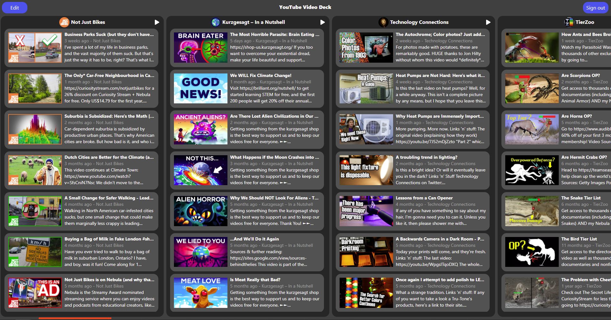
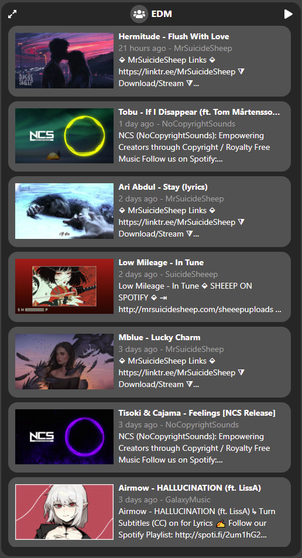
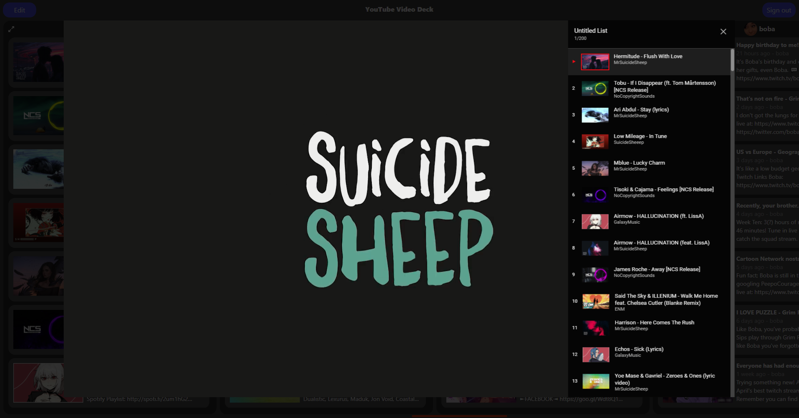
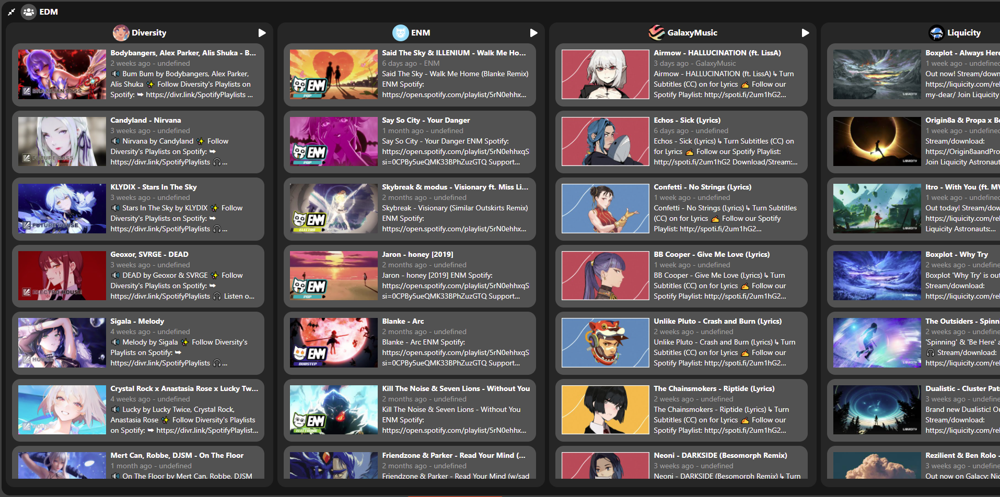

# YouTube Video Deck
[svenkonings.github.io/Youtube-Video-Deck](https://svenkonings.github.io/Youtube-Video-Deck/)

To use the deck you need to sign in with Google.
Since the app still has the testing status you need to be manually added to the test user group to be able to sign in.
**Please send your Google email to [youtubevideodeck@svenkonings.nl](mailto:youtubevideodeck@svenkonings.nl) if you want to try out the deck!**

YouTube Video Deck is an alternative way to view your YouTube subscriptions!

Subscriptions can be grouped to create a combined list:

It is also possible to watch all videos from a subscription group in a playlist:

Groups can be expanded to view individual subscriptions:

